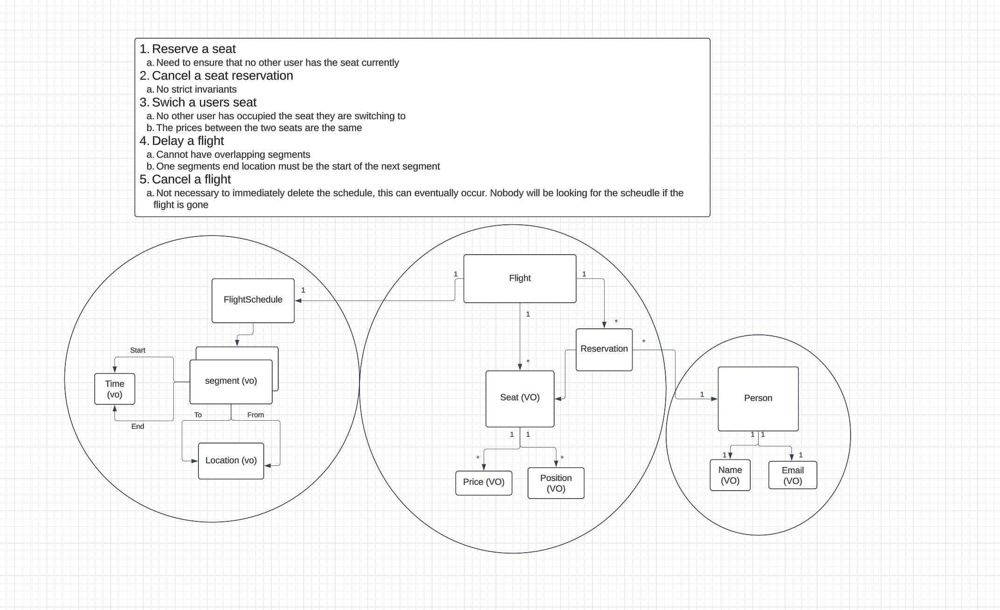

## Description

- This is my firs attempt to model a problem domain with DDD, the example is outlined below.

## Project outline

## TODO
- Make a user registration service
- Make an anti-corruption layer to communicate with the user service
- Have the creation of a reservation need to communicate with that service in order to make the reservation
- Upon deletion of a user, publish an event, and conusme it to delete the user's reservation

